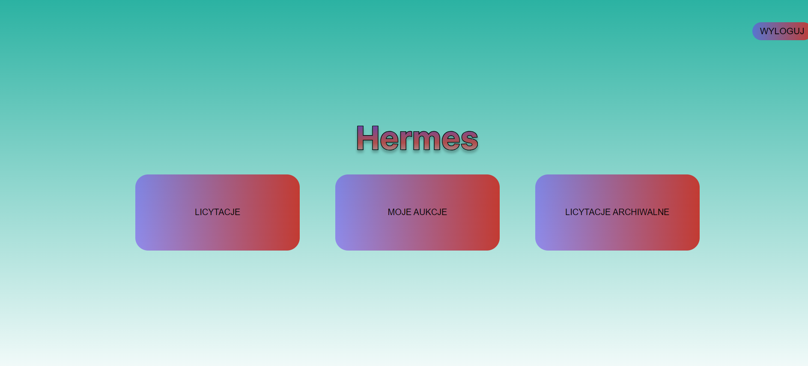
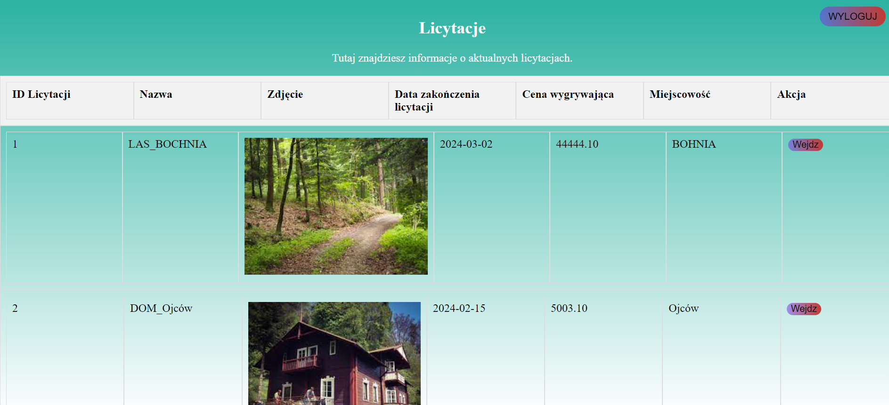
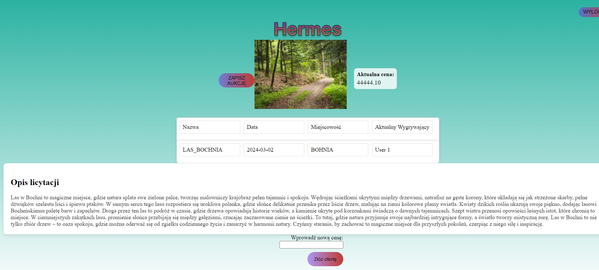

# Hermes licytacje

Założeniem tej strony jest możliwość prowadzenia licytacji i dołączania do nich bez potrzeby pojawiania się na licytacji osobiście.

Mój moduł wymaga następujących modułów:

    Docker Desktop
    
    nginx
    
    php
    
    Configuration
    
    Open Docker Desktop.
    
    Open the project folder.
    
    Type in terminal "docker-compose up".
    
    In a browser open "localhost:8080".

Oto kilka screenshotów z tego projektu:

HOME PAGE:

LICYTACJE:

DANA LICYTACJA:
